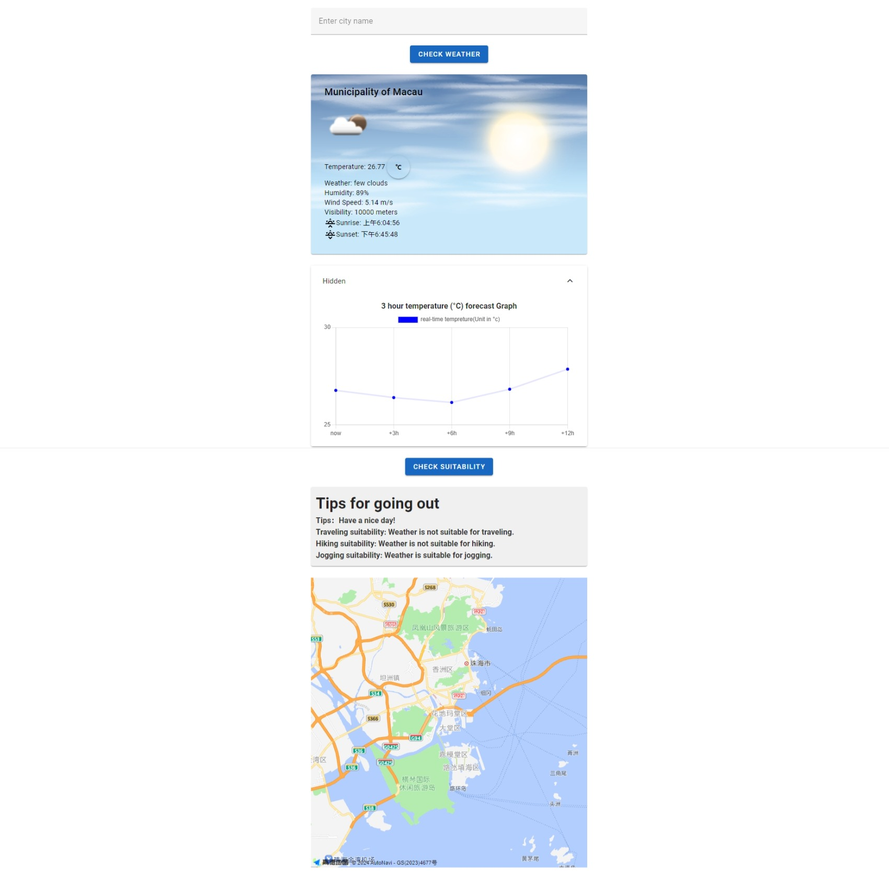
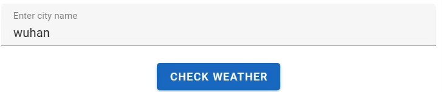
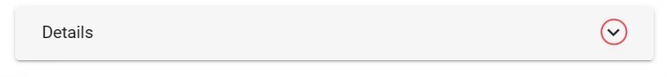
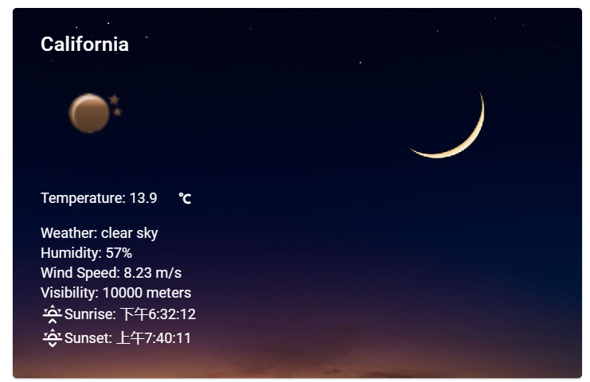
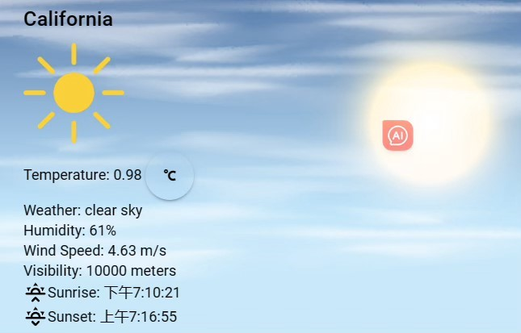
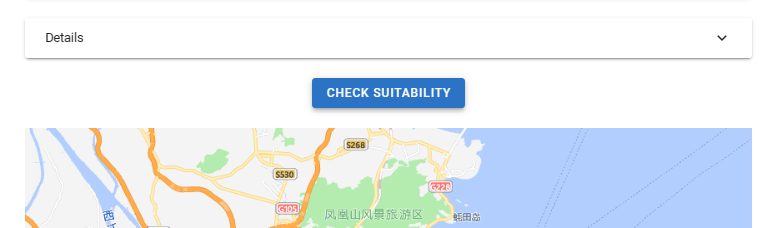
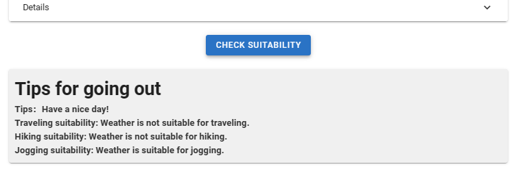

# Overall
This project is to create a simple weather app. It shows temperature, weather, wind speed, humidity, sunrise and sunset times,map and real-time temperature changes.

Here is the overall picture
  


# Declaration:
 + **package/library**:
   + **venv**:
     Flask-Cors, 
     Jinja2, 
     MarkupSafe, 
     Blinker, 
     Certifi, 
     Charset Normalizer, 
     Click, 
     Colorama, 
     Flask, 
     IDNA, 
     Itsdangerous, 
     pip, 
     Requests, 
     Urllib3, 
     Werkzeug.
   
   + **weather-client-copy**:
     Flask, Vue.js, Chart.js
     
   + **weather-server**:
     Flask-Cors, 
     Jinja2, 
     MarkupSafe, 
     blinker, 
     Certifi, 
     Charset Normalizer, 
     Click, 
     Colorama, 
     Flask, 
     Flask-Cors, 
     IDNA, 
     Itsdangerous, 
     pip, 
     Requests, 
     Urllib3, 
     Werkzeug, 
     Setuptools, 
     Pkg Resources, 
     Distutils Hack
     
 + **Environment**:
   vue.js,   
   flask
     
 + **usage of software**: This software aids in showcasing timely and accurate weather condition of a certain region / city accroding to the user's prompt. All the weather information are based on real time data such as temperature, humidity, visibility, etc. It also provides tips like the suitability of certain outdoor activities.
    

# Purpose
+ **Type of Software Development Process**  
      Agile Software 
+ **Reason**

 Agile methodologies offer several benefits that align well with the requirements and challenges of developing a weather forecast software.
1. Flexibility and Adaptability: Agile methodologies emphasize flexibility and adaptability. In weather forecasting, new data and information constantly emerge, making it essential to respond quickly to changes. Agile allows for iterative development and frequent feedback loops, enabling the software to adapt and incorporate new data sources or models as they become available.
2. Incremental Development: Agile promotes incremental development, where software features are developed in short iterations. This approach allows for early delivery of working software and enables the weather forecast software to evolve gradually. It allows meteorologists and forecasters to start using and benefiting from the software sooner, even if it is not yet fully complete.
3. Rapid Feedback and Validation: Agile methodologies emphasize regular feedback from users, stakeholders, and subject matter experts. For a weather forecast software, this means that meteorologists and forecasters can provide input and validate the accuracy and relevance of the predictions during the development process. This feedback loop enables the software to be refined and improved continuously, enhancing its performance and reliability.
4. Risk Mitigation: Weather forecasting involves inherent uncertainties and risks. Agile methodologies promote risk mitigation through regular testing and validation. By continuously testing and validating the software against historical data or real-time observations, potential issues or inaccuracies can be identified early on, allowing for timely adjustments and improvements.
5. Time-to-Market Advantage: Agile methodologies can provide a competitive advantage in terms of time-to-market. Weather forecast software developed using agile practices can be released in incremental stages, allowing users to benefit from early functionality while additional features are being developed. This can be particularly valuable in a field where accurate and up-to-date weather forecasts are critical for various industries and decision-making processes.

 In summary, adopting agile software development for a weather forecast software offers flexibility, adaptability, and rapid feedback loops. These benefits enable the software to evolve, incorporate new data sources, and provide accurate and timely predictions, ultimately enhancing the user experience and supporting informed decision-making in various sectors reliant on weather forecasts.
  
# Software Development plan
 ### Development Process/Status (sample only)

 ```mermaid
 gantt
     title Weather App Development Process
     dateFormat  YYYY-MM-DD

     section Project Initialization
     Project Initialization   : 2024-04-01, 7d

     section Research and Planning
     Research and Planning    : 2024-04-08, 14d

     section Backend Development
     Backend Development     : 2024-04-22, 21d

     section Frontend Development
     Frontend Development    : 2024-05-13, 21d

     section Integration and Testing
     Integration and Testing : 2024-06-03, 14d

     section Deployment and Launch
     Deployment and Launch   : 2024-06-17, 7d

     section Post-Launch Support (Ongoing)
     Post-Launch Support     : 2024-06-24, 365d
```
### Members
1. Ray (P2111671)
2. Angela (P2204782)
3. Vikey (P2211317)
4. Josh (P2204750)
5. William (P2204954)
      
 ### Schedule
 O(1) Constant Time Complexity
 - time taken to retrieve and display weather information is unlikely to scale with the size of the input data or the number of users
 - remains relatively constant regardless of factors such as the number of locations being queried or the volume of weather data being displayed.
   
 ### Algorithm   

 + **descriptions**  
 When you enter the site, the screen can automatically display the weather conditions for your location and a map as long as you authorize it .The site allows you to search for weather conditions by typing place names into the search box.To view the advice for going out, you can also click the "Check Suitability" button. It will show what to do about the weather today and whether it is suitable to do some outdoor sports. Additionally, you can click on the temperature unit to implement different units of temperature switch. Furthermore, different background images can be displayed depending on the sunrise and sunset of the location. Lastly, you can click the Detail row to reveal the temperature trend chart, which displays changes in temperature in real time.When you click a point on the axis, details of the temperature are displayed.

+ **Installations and configurations**  
  Server-side:  
     first you need to open virtual environment  
          
      pip install flask  
      pip install flask-cors        
      pip install requests  
      flask run  
    
  Client-side: 
  ```
     npm install  
     npm install chart.js –save  
     npm i @amap/amap-jsapi-loader --save    
     npm run serve
   ```  

 
+ **use1**
  Enter the city name in the search bar and click the check weather button    
  
+ **use2**
  Switch to other units for temperature  
      
  
+ **use3**
  Click on the red circle location to show real-time temperature changes.
    If you don't want it, click again to close it.
    
  
+ **use4**
Depending on the day of the city in the morning and night, different weather background pictures are displayed:

 

+ **use5**
You can also click the "check suitability" button to view outing tips, which will spnghow whether today is suitable for traveling, jogging, etc.

 

### Future plan
 Here are some ideas for the future plan of software 
1. User Personalization Settings: In addition to the default display of weather units and interface themes, the personalization settings can be further expanded. For example, allowing users to select the weather metrics they want to focus on, such as precipitation, wind speed, humidity, etc., and highlighting them in the forecast results. Furthermore, implementing the ability to save and remove favorite cities means that users can add their most loved or frequently monitored cities to a favorites list for quick access to the weather forecasts of those cities. Users can add cities to their favorites by clicking on a 'Favorite' button on the search results or specific city's weather page.
2. Add map function：

   (1) Adding Distance and Transportation Mode Feature:Enhance the practicality of the software by utilizing the location information and user's search data. Display the distance between two locations in the weather forecast results and provide options for different transportation modes such as walking, driving, and public transportation.

   (2) Calorie Consumption Calculation Feature:For users who choose the walking transportation mode, the software can calculate the calories burned during the walk based on the distance and user's height, weight, etc. This can help users understand their physical activity level and provide additional fitness and health management functionality.
  
   (3) Integrating Map Navigation Feature:Combine weather forecast and map data to provide real-time navigation for users. Users can directly view weather conditions within the software and utilize the map navigation feature to find the optimal route. This will enable users to better plan their trips, avoiding traffic congestion or other unfavorable factors during inclement weather conditions.

3. Multi-language Support: In addition to adding multi-language support, further provide localized weather information and cultural features. Based on the user's location or selected language, offer weather data, weather phenomenon descriptions, traditional customs, and other information relevant to the local area. This will increase the user's sense of familiarity and convenience with the weather forecast, providing a more personalized service experience.

4. Weather Alerts and Push Notifications: Allow users to set weather alerts and push notifications to receive alerts or reminders for specific weather conditions. For example, when weather conditions are not suitable for outdoor activities or when there are extreme weather warnings, users can receive instant notifications to take appropriate actions.

# URL


  
