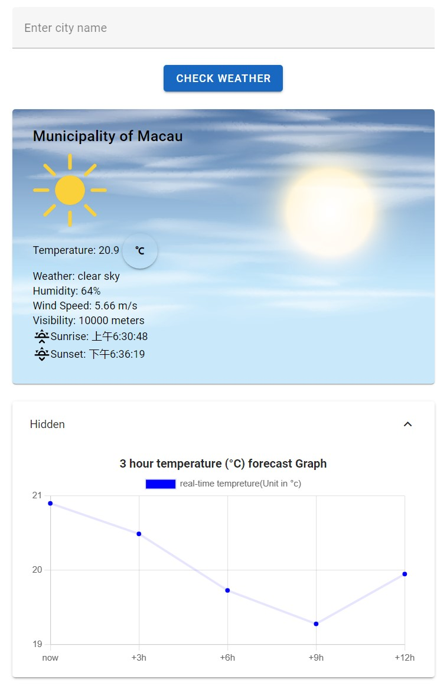
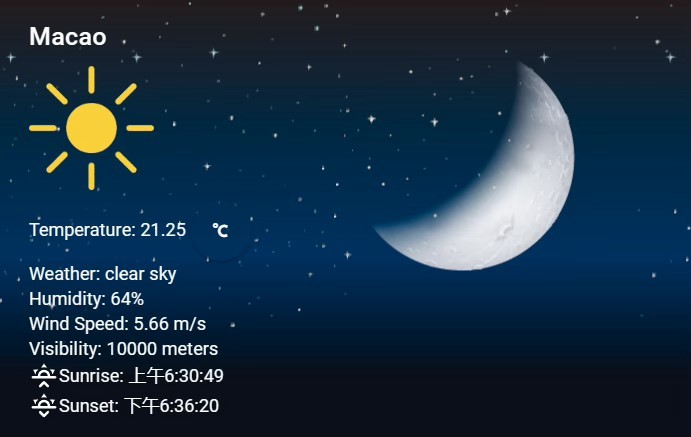

# Project description
This project uses the front and back end separation technique. The front end mainly uses the vue framework and the back end uses flask technology. 
It shows temperature, weather, wind speed, humidity, sunrise and sunset times, and real-time temperature changes.

Here is the overall picture

# How to use
  + **Installations and configurations**
  Server-side:
     first you need to open virtual environment 
      .\venv\Scripts\activate   
      pip install flask  
      pip install flask-cors          
      pip install requests   
      flask run  
  Client-side:     
     npm install
     npm install chart.js –save
     npm run serve
 + **descriptions**
 When you enter the site, the screen can automatically display the weather conditions for your location as long as you authorize it .The site allows you to search for weather conditions by typing place names into the search box. And you can click on the temperature unit to implement different units of temperature switch. Furthermore, different background images can be displayed depending on the day and night of the location. Finally, there is a temperature trend graph showing real-time temperature changes, you can click on the detail row to show the diagram.
+ **use1**
  Enter the city name in the search bar and click the check weather button  
  
+ **use2**
  Switch to other units for temperature
  
  
+ **use3**
  Click on the red circle location to show real-time temperature changes.
    If you don't want it, click again to close it.
    
+ **use4**
Depending on the day of the city in the morning and night, different weather background pictures are displayed:

# implement:
    API: The back end gets the data from the openweathermap API.

    Fetch Weather:  In js , fetchWeather( ) is mainly used to get data from the back end.

    Locate function: The mounted hook is called after the component is mounted. It calls the getLocation method to fetch the weather information for the default city :Your current location.

    Real-time temperature chart: This make use of the chart.js technology. And Logic is used to hide and display the chart.

   search bar: The city name is passed into the backend to perform a series of queries on weather conditions. However, if you enter an invalid city name, the screen will show that your query is incorrect.

   Temperature switching: formattedTemperature converts the temperature to the desired unit (Celsius or Fahrenheit)

   Weather Sunrise and Sunset:This include an SVG icon of a sunrise and sunset using the Material Design Icons (MDI) library.

   Time background switch: This is done by getting the current timestamp and comparing it with sunset and sunrise times, thus changing the background picture.
    
  
